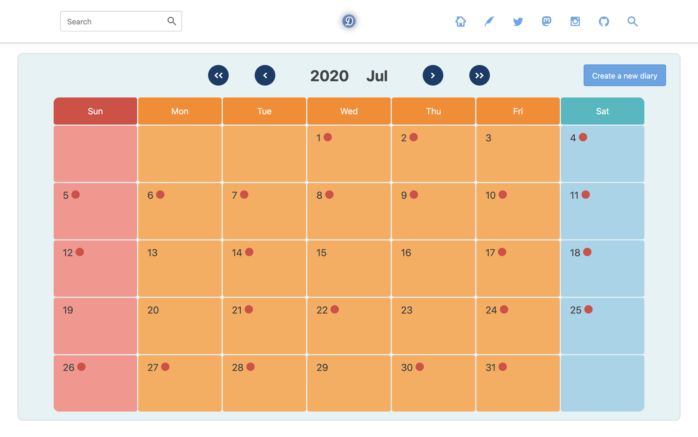

# Diary
Simple diary application. Unlike a blog, this application is suitable for writing everyday life, events, thoughts and other miscellaneous contents daily in a sense of diary.



## Setup
You should create a new user to post your diary.

```
# For development environment
$ bundle exec rails diary:create_user
```
Or
```
# For production environment
$ RAILS_ENV=production bundle exec rails diary:create_user
```
```
Create a new user
username: alice
password: (Not shown)

Created a new user: alice
```

You can now sign in with username and password that you set up in `/login` page.

## Environment Variables
The environment variables are under the control of `.env` file. Copy `.env.sample` and rename it as `.env`. Then replace the environment variables with your own environment.

```bash
$ cp .env.sample .env
```

### Secret Key Base (required)
`SECRET_KEY_BASE` is a random string for the secret key base of production environment. The secret key base can be generated by running the following command.

```
$ bundle exec rails secret
```

Copy the string generated by the command above and paste it to `SECRET_KEY_BASE`. This environment is unnecessary for development environment.

### Time Zone (required)
`TIME_ZONE` is your country’s time zone. To list all time zones, you can use the following command.

```
$ bundle exec rails time:zones
```

## License
All codes of this repository are available under the MIT license. See the [LICENSE](https://github.com/noraworld/diary.noraworld.jp/blob/master/LICENSE) for more information.
